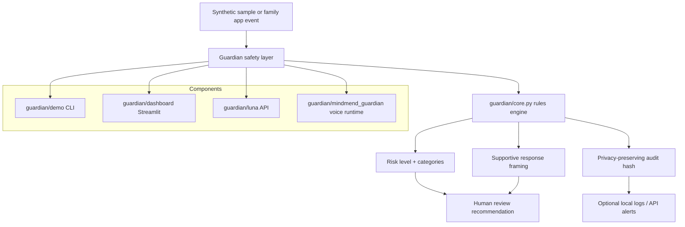

# MindMend Guardian

**Privacy-first, local-first AI safety prototype for youth and family wellness.**

MindMend Guardian is a portfolio-grade engineering prototype from **Michigan MindMend Inc.** It demonstrates how families can explore youth safety workflows with risk-signal detection, calm support language, privacy-preserving audit events, and human-in-the-loop review — without default cloud dependency or unsupervised automation.

[](pyproject.toml)
[](https://github.com/MiMindMendinc/mindmend-guardian/actions/workflows/ci.yml)
[](LICENSE)
[](#project-status)

> Built by Michigan MindMend Inc. as a privacy-first responsible AI safety prototype.

---

## What this is

- A **local-first safety layer** with import-safe core helpers in `guardian/core.py`
- A **runnable CLI demo** (`python -m guardian.demo`) using synthetic sample text only
- An optional **Streamlit dashboard demo** for recruiters, sponsors, and contributors
- A modular **Luna API backend** for message/location safety checks (prototype)
- A **voice runtime sketch** for edge deployment experiments (hardware-dependent)
- Honest documentation for privacy, threat modeling, and responsible use

## What this is not

MindMend Guardian does **not** claim:

- medical or clinical validation
- guaranteed detection of abuse, grooming, bullying, or self-harm
- HIPAA / COPPA compliance out of the box
- production readiness for unsupervised child safety
- replacement for parents, guardians, clinicians, or emergency services

If someone may be in immediate danger, contact emergency services. In the United States, call or text **988** for the Suicide & Crisis Lifeline.

---

## Architecture



See [`docs/ARCHITECTURE.md`](docs/ARCHITECTURE.md) for module boundaries and design notes.

---

## Quickstart

```bash
git clone https://github.com/MiMindMendinc/mindmend-guardian.git
cd mindmend-guardian
python3.11 -m venv .venv
source .venv/bin/activate
python -m pip install --upgrade pip
pip install -e ".[dev]"
pytest
```

## Run the local demo

No cloud services, credentials, or real child data required:

```bash
python -m guardian.demo
```

JSON output:

```bash
python -m guardian.demo --json
```

The demo shows:

- risk level (`low`, `medium`, `high`, `crisis`)
- matched signal categories
- supportive response text
- whether human review is recommended
- a privacy-preserving audit hash (raw text is not stored by default)

## Optional dashboard demo

```bash
pip install -e ".[simulator]"
python -m guardian.dashboard
# or: streamlit run guardian/dashboard/app.py
```

Uses synthetic sample messages only. No Firebase or external APIs required.

---

## Run tests

```bash
pip install -e ".[dev,api]"
pytest
ruff check guardian tests
ruff format --check guardian tests
```

---

## Privacy and safety principles

- **Local-first by design** — core logic runs without cloud dependency
- **Data minimization** — audit events store hashes, not raw text by default
- **Human-in-the-loop** — AI suggests; trusted adults decide
- **Supportive language** — calm framing instead of fear-based alerts
- **Honest scope** — prototype status is visible in docs and README

Details: [`docs/PRIVACY_AND_SAFETY.md`](docs/PRIVACY_AND_SAFETY.md)

---

## Security model summary

- Secrets and credentials come from environment variables (see [`.env.example`](.env.example))
- Luna API defaults bind to `127.0.0.1` with debug disabled
- JWT auth enabled by default for safety endpoints (`LUNA_REQUIRE_AUTH=true`)
- Request validation on API payloads
- CI runs linting, tests, dependency audit, and secret-pattern checks

Details: [`docs/SECURITY_CONFIG.md`](docs/SECURITY_CONFIG.md) · [`docs/THREAT_MODEL.md`](docs/THREAT_MODEL.md)

---

## Project status

**Active prototype / portfolio project (v0.3.0).**

Verified today:

- import-safe core safety helpers with tests
- local CLI demo and optional dashboard demo
- modular Luna API with env-based configuration
- GitHub Actions CI (pytest, ruff, pip-audit, secret scan)

Still evolving:

- voice runtime integration with `guardian/core.py`
- encrypted local logging example
- parent review UI
- edge deployment packaging (Docker / Raspberry Pi)

Details: [`docs/STATUS.md`](docs/STATUS.md)

---

## Roadmap

See [`docs/ROADMAP.md`](docs/ROADMAP.md). Near-term focus:

- synthetic scenario test expansion
- parent/guardian review workflow mock
- encrypted local audit log example
- deployment notes for edge devices
- demo screenshots and short walkthrough video

---

## Documentation

| Doc | Purpose |
|-----|---------|
| [`docs/DEMO.md`](docs/DEMO.md) | Demo commands and sample output |
| [`docs/ARCHITECTURE.md`](docs/ARCHITECTURE.md) | Module layout and data flow |
| [`docs/API.md`](docs/API.md) | Luna HTTP API contract |
| [`docs/SECURITY_CONFIG.md`](docs/SECURITY_CONFIG.md) | Environment variables and safe defaults |
| [`docs/PRIVACY_AND_SAFETY.md`](docs/PRIVACY_AND_SAFETY.md) | Privacy and safety principles |
| [`docs/THREAT_MODEL.md`](docs/THREAT_MODEL.md) | Threat model and mitigations |
| [`docs/RELEASE.md`](docs/RELEASE.md) | Versioning and release process |
| [`CHANGELOG.md`](CHANGELOG.md) | Version history |
| [`SETUP.md`](SETUP.md) | Full installation guide |

---

## Contributing

We welcome thoughtful contributions that respect privacy-first design and
human-in-the-loop safety boundaries.

- Read [`CONTRIBUTING.md`](CONTRIBUTING.md) before opening a PR
- Follow our [`Code of Conduct`](CODE_OF_CONDUCT.md)
- Use [issue templates](https://github.com/MiMindMendinc/mindmend-guardian/issues/new/choose) for bugs and features
- See [`SUPPORT.md`](SUPPORT.md) for help routing

This project is released under the [MIT License](LICENSE). See [`CHANGELOG.md`](CHANGELOG.md)
for version history.

---

## Responsible disclosure

Report security concerns privately following [`SECURITY.md`](SECURITY.md). Do not open public issues for sensitive vulnerabilities.

---

## Built by

**Lyle Perrien II**  
Founder, **Michigan MindMend Inc.**  
Owosso, Michigan

Building privacy-first, offline-capable AI safety tools for kids, families, and communities.

## License

MIT

---

## Visual preview

> Screenshot and demo GIF placeholders — capture after running the dashboard locally.

| CLI demo | Dashboard demo |
|----------|----------------|
| `docs/assets/cli-demo-placeholder.png` | `docs/assets/dashboard-demo-placeholder.png` |

```bash
# Suggested capture commands (run locally)
python -m guardian.demo > docs/assets/cli-demo-sample.txt
python -m guardian.dashboard
```
