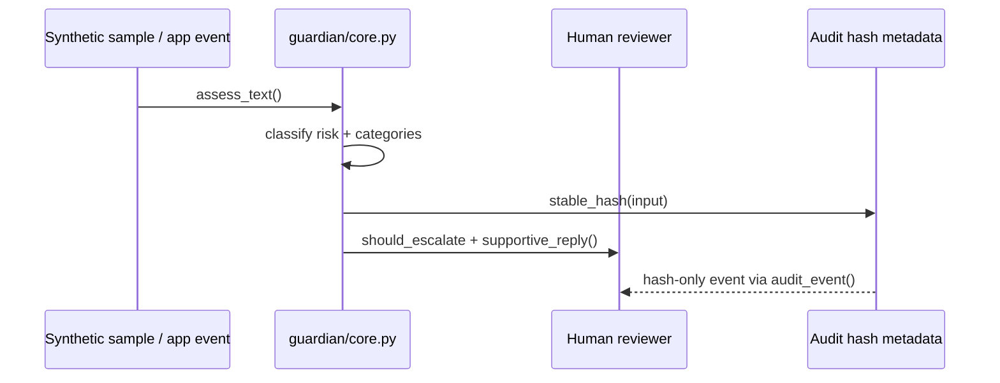

# Architecture

MindMend Guardian separates **import-safe library code** from **hardware- or network-dependent runtimes**.

## Design goals

1. Core safety logic must import without side effects (no microphones, models, servers, or loops).
2. Runtime components must be optional and explicitly installed.
3. Privacy-preserving audit events must avoid storing raw sensitive text by default.
4. Humans remain responsible for review and escalation.

## Module map

```text
guardian/
├── core.py                 # Rules-based risk assessment, supportive replies, audit hashes
├── demo/                   # Local CLI demo (synthetic samples only)
├── dashboard/              # Optional Streamlit dashboard demo
├── mindmend_guardian.py    # Voice runtime entrypoint (hardware-dependent)
└── luna/
    ├── config.py           # Environment-driven settings
    ├── auth.py             # JWT verification and token issuance
    ├── validation.py       # HTTP payload validation
    ├── safety.py           # Message scanning helpers
    ├── geofence.py         # Location boundary checks
    ├── alerts.py           # Optional Firebase alerting
    ├── app.py              # Flask app factory
    └── luna_safety_core.py # Server CLI entrypoint
```

## Data flow (core path)



## Runtime boundaries

| Component | Import safe? | External deps |
|-----------|--------------|---------------|
| `guardian/core.py` | Yes | stdlib only |
| `guardian/demo` | Yes | core only |
| `guardian/dashboard` | Yes until run | Streamlit (`simulator` extra) |
| `guardian/luna/app.py` | Yes | Flask (`api` extra) |
| `guardian/mindmend_guardian.py` | Yes (since v0.3) | PyAudio, torch, models (`voice` extra) |

## Integration status

- `guardian/core.py` is the canonical rules engine for the CLI demo and tests.
- Luna currently uses its own keyword lists for grooming/toxicity checks; unifying with `core.py` is planned.
- The voice runtime does not yet call `assess_text()` on transcribed speech.

## Deployment modes (prototype)

1. **Demo mode** — `python -m guardian.demo` (no credentials)
2. **Dashboard mode** — optional Streamlit UI for presentations
3. **API mode** — Luna Flask backend on localhost with env config
4. **Voice mode** — local microphone loop with optional Whisper/LLM/TTS

None of these modes should be treated as unsupervised child-safety production systems without professional review.
